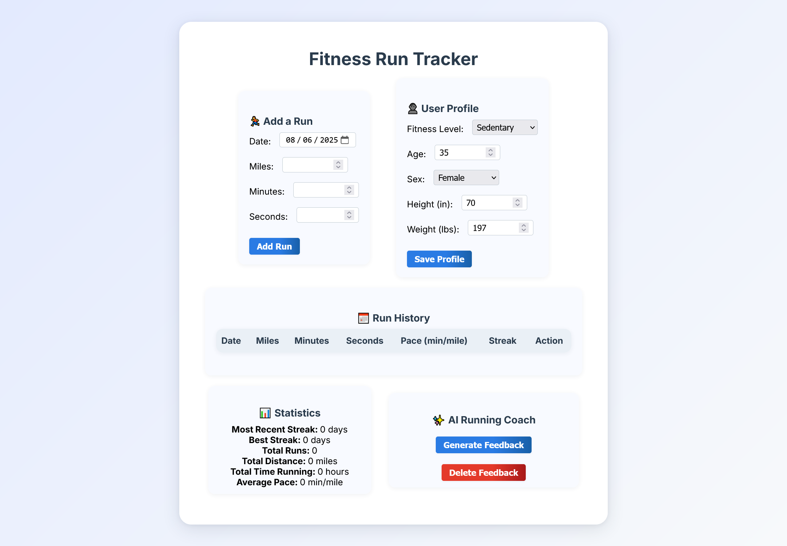
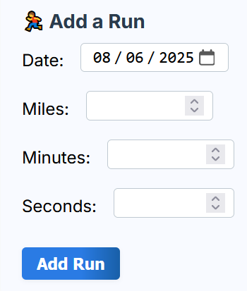
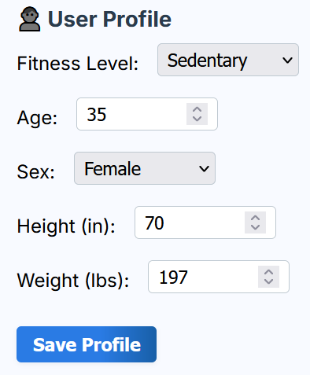
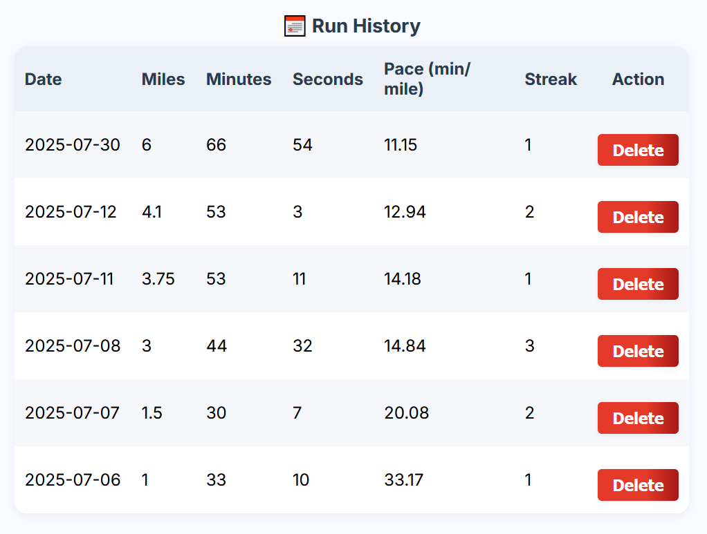
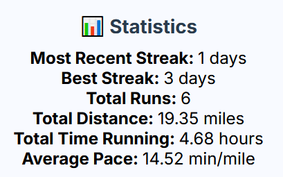
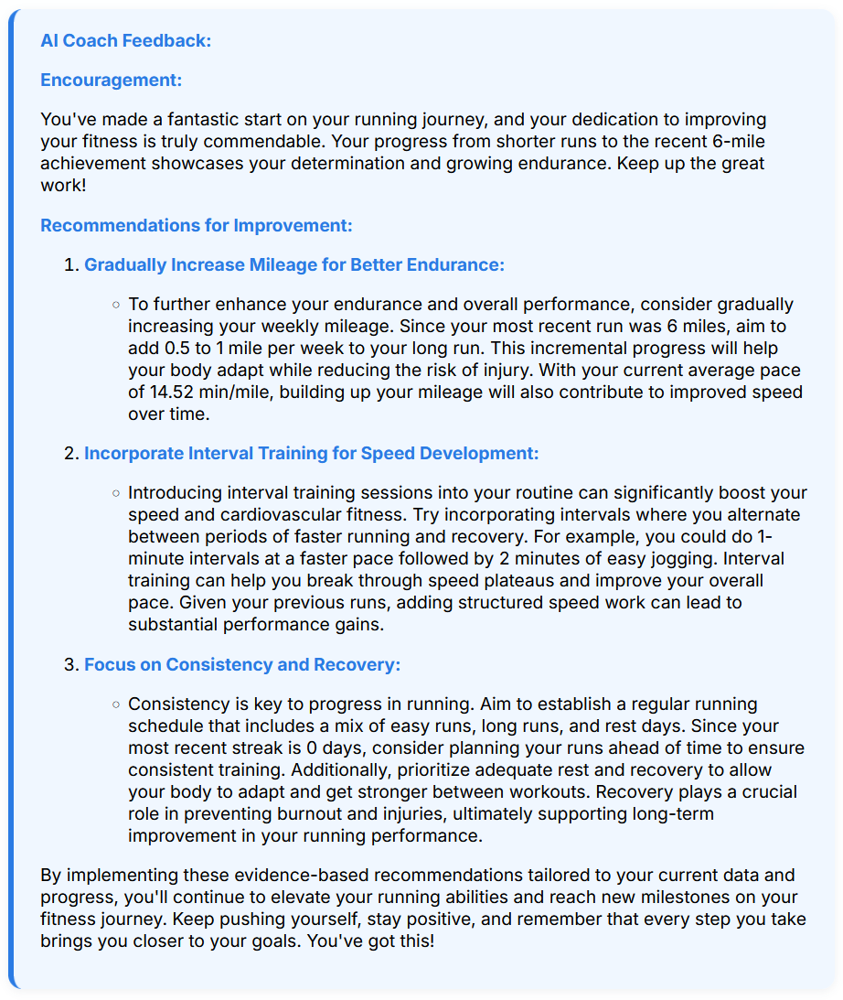

# Fitness Run Tracker 🏃‍♂️

A full-stack Laravel web application for tracking your running progress, managing your fitness profile, and receiving personalized AI-powered running feedback using the OpenAI API.

---

## Features

- **Add a Run:** Log your runs with date, distance, and time.
- **User Profile:** Set your fitness level, age, sex, height, and weight for personalized coaching.
- **Run History:** View a table of all your logged runs, including pace and streaks.
- **Statistics:** See your most recent streak, best streak, total runs, total distance, total time, and average pace.
- **AI Running Coach:** Get personalized running feedback and improvement tips powered by OpenAI.

---

## Setup Instructions

1. **Clone the Repository**
    ```bash
    git clone https://github.com/yourusername/cs85-finalproject-laravel.git
    cd cs85-finalproject-laravel
    ```

2. **Install Dependencies**
    ```bash
    composer install
    npm install
    npm run build
    ```

3. **Environment Setup**
    - Copy `.env.example` to `.env` and update your database and OpenAI API credentials.
    ```bash
    cp .env.example .env
    php artisan key:generate
    ```

4. **Run Migrations**
    ```bash
    php artisan migrate
    ```

5. **Serve the Application**
    ```bash
    php artisan serve
    ```
    Visit [http://localhost:8000](http://localhost:8000) in your browser.

---

## Screenshots

Below are screenshots demonstrating the main features of the app:

### Home Page


### Add a Run


### User Profile


### Run History


### Statistics


### AI Running Coach
